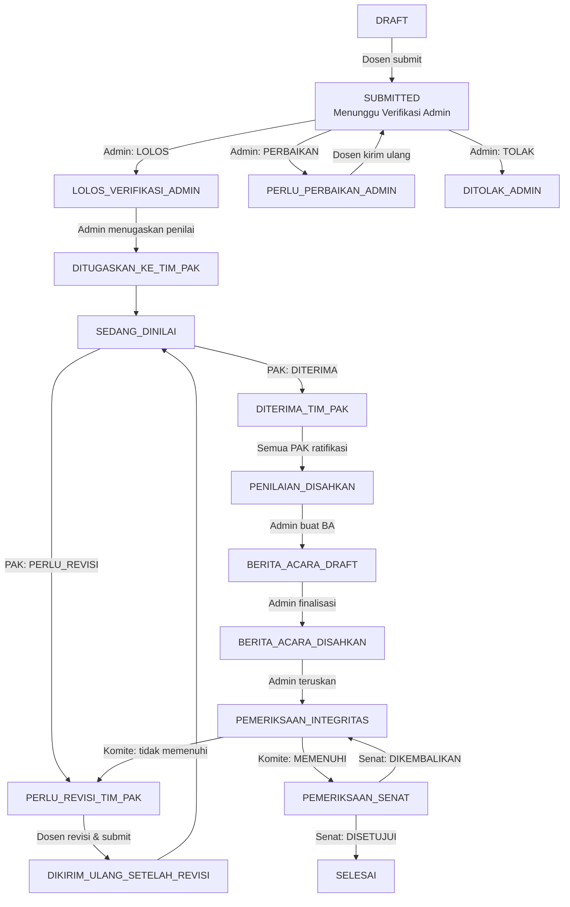
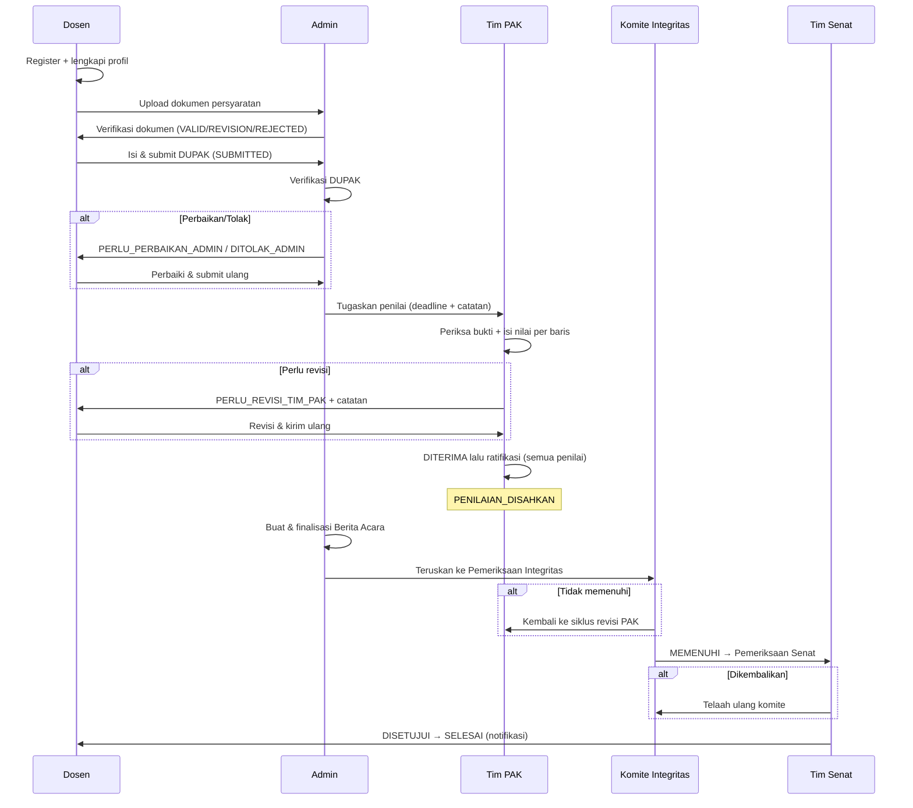

<!-- @format -->

# JAFUNG SMART — Fitur & Alur Penggunaan Aplikasi

Portal mandiri pengajuan kenaikan jabatan fungsional dosen Universitas Muhammadiyah Makassar. Dokumen ini menjelaskan fitur dan alur penggunaan aplikasi secara rinci untuk seluruh role.

---

## 1. Gambaran Umum

Aplikasi memiliki **5 role aktif**:

| Role                         | Prefix Halaman | Tugas Utama                                                                 |
| ---------------------------- | -------------- | --------------------------------------------------------------------------- |
| `DOSEN`                      | `/dosen`       | Melengkapi profil, upload dokumen, mengisi & mengirim DUPAK, revisi         |
| `ADMIN`                      | `/admin`       | Verifikasi dokumen & DUPAK, menugaskan Tim PAK, Berita Acara, kelola akun   |
| `TIM_PAK`                    | `/pak`         | Menilai angka kredit DUPAK, keputusan diterima/revisi, ratifikasi penilaian |
| `KOMITE_INTEGRITAS_AKADEMIK` | `/komite`      | Pemeriksaan integritas akademik atas pengajuan yang sudah ber-Berita Acara  |
| `TIM_SENAT`                  | `/senat`       | Persetujuan akhir (approve/kembalikan) pengajuan                            |

Setiap role login lewat halaman yang sama (`/login`) dan otomatis diarahkan ke dashboard masing-masing. Semua route dijaga middleware (JWT cookie `sister_pak_session`, sesi 8 jam).

### Pipeline Status DUPAK (state machine)

Aturan perpindahan status dikunci di `lib/dupak-workflow.ts` (`TRANSITIONS` + `assertTransition`) — perpindahan di luar peta ini ditolak API.

---

## 2. Role DOSEN

### Fitur

- **Register mandiri** (`/register`): isi identitas (NIDN/NUPTK, prodi, jabatan) + foto profil wajib (JPEG/PNG/WEBP maks 2MB).
- **Dashboard** (`/dosen/dashboard`): metrik dokumen (kebutuhan, terupload, valid, pending+revisi), progress bar, timeline aktivitas.
- **Upload Dokumen** (`/dosen/dokumen`): daftar kategori & requirement dokumen, upload per requirement (file PDF/JPEG/PNG, link Google Drive, atau metadata), riwayat versi, preview file.
- **Formulir DUPAK** (`/dosen/dupak`): wizard 4 langkah.
- **Pengaturan Profil** (`/dosen/settings`): ubah data profil + foto.
- **Notifikasi** (lonceng di header): hasil verifikasi, permintaan revisi, status akhir.
- **Lupa password** (`/lupa-password`): verifikasi email + NIDN → permintaan reset masuk ke Admin (admin yang menetapkan password sementara).

### Alur rinci

**Tahap 1 — Registrasi & kelengkapan profil**

1. Dosen membuka `/register`, mengisi data diri + foto profil → akun langsung `ACTIVE` dengan role `DOSEN`.
2. Login di `/login` → diarahkan ke `/dosen/dashboard`.

**Tahap 2 — Upload dokumen persyaratan**

1. Buka `/dosen/dokumen`. Dokumen dikelompokkan per kategori (mis. PROFIL_KEPAKARAN, ANGKA_KREDIT).
2. Setiap requirement punya tipe input berbeda:
   - **FILE**: upload PDF/JPEG/PNG (maks default 5MB; file besar → wajib link Google Drive).
   - **METADATA_ONLY**: isi teks (mis. mata kuliah diampu 1–3 item).
   - Beberapa requirement bersifat **tahunan** (mis. SKP per tahun sejak 2023) — satu entri per tahun.
3. Upload ulang membuat **versi baru** (riwayat versi tersimpan); status kembali `PENDING` menunggu verifikasi admin.
4. Status per dokumen: `PENDING` → `VALID` / `REVISION` / `REJECTED` (di-set Admin, selalu ada catatan bila revisi/tolak).
5. Dosen menerima notifikasi setiap ada hasil verifikasi, lalu memperbaiki dokumen berstatus `REVISION`/`REJECTED`.

**Tahap 3 — Mengisi & mengirim DUPAK**

1. Buka `/dosen/dupak` — wizard 4 langkah:
   - **Langkah 1**: header (nomor, instansi, masa penilaian).
   - **Langkah 2**: data perorangan (10 field: nama, NIDN, karpeg, TTL, jenis kelamin, pendidikan, jabatan+TMT, masa kerja lama/baru, unit kerja).
   - **Langkah 3**: angka kredit per baris kegiatan (kolom **pengusul lama/baru**) + **link bukti Google Drive per baris** kegiatan.
   - **Langkah 4**: preview & submit.
2. Bisa **Simpan Draft** kapan saja (progress: header 25% + personal 45% + kredit 30%).
3. **Submit** → status `SUBMITTED`, notifikasi ke semua Admin. Setelah submit, form **terkunci** (tidak bisa diedit).

**Tahap 4 — Merespons hasil**

| Status yang diterima    | Yang harus dilakukan dosen                                                                                                                              |
| ----------------------- | ------------------------------------------------------------------------------------------------------------------------------------------------------- |
| `PERLU_PERBAIKAN_ADMIN` | Form terbuka lagi → perbaiki sesuai catatan admin → submit ulang                                                                                        |
| `PERLU_REVISI_TIM_PAK`  | Form terbuka lagi → perbaiki sesuai **catatan revisi Tim PAK** → submit ulang (status jadi `DIKIRIM_ULANG_SETELAH_REVISI`, notifikasi ke penilai aktif) |
| `DITOLAK_ADMIN`         | Pengajuan ditolak; bisa mengajukan ulang dari awal                                                                                                      |
| `SELESAI`               | Pengajuan disetujui penuh — proses selesai                                                                                                              |

> Form DUPAK hanya bisa diedit saat status termasuk `isLecturerEditable` (DRAFT, PERLU_PERBAIKAN_ADMIN, PERLU_REVISI_TIM_PAK, dll). Di luar itu API menolak perubahan.

---

## 3. Role ADMIN

### Fitur

- **Dashboard** (`/admin/dashboard`): total dosen/dokumen, pipeline status, submission terbaru.
- **Kelola Dosen** (`/admin/dosen`, `/admin/dosen/[id]`): daftar+pencarian dosen, detail lengkap, verifikasi dokumen per submission, reset password, suspend (soft delete).
- **Monitoring DUPAK** (`/admin/dupak`, `/admin/dupak/[id]`): pusat kendali per pengajuan — timeline status, verifikasi, penugasan, berita acara, preview penilaian, export **PDF/Excel**.
- **Penugasan** (`/admin/penugasan`): daftar pengajuan siap ditugaskan & penugasan aktif.
- **Kelola Tim PAK** (`/admin/tim-pak`): angkat/berhentikan role TIM_PAK, aktivasi/suspend akun, reset password.
- **Berita Acara** (`/admin/berita-acara`): kelola BA pemeriksaan penilaian.
- **Notifikasi**: pengajuan baru, permintaan reset password, dsb.

### Alur rinci

**Tahap 1 — Verifikasi dokumen dosen**

1. Buka `/admin/dosen` → pilih dosen → tab dokumen.
2. Per submission: preview file → putuskan `VALID` / `REVISION` / `REJECTED` (catatan **wajib** untuk revisi/tolak).
3. Sistem menghitung ulang status agregat dosen (documentStatus, verificationStatus) + kirim notifikasi ke dosen.

**Tahap 2 — Verifikasi DUPAK masuk**

1. Buka `/admin/dupak` → pengajuan berstatus `SUBMITTED`.
2. Di `/admin/dupak/[id]` gunakan form verifikasi, tiga keputusan:
   - **LOLOS** → `LOLOS_VERIFIKASI_ADMIN` (siap ditugaskan),
   - **PERBAIKAN** → `PERLU_PERBAIKAN_ADMIN` (kembali ke dosen),
   - **TOLAK** → `DITOLAK_ADMIN`.
3. Ada dua jenis catatan: **catatan internal** (tidak dilihat dosen) dan **catatan untuk dosen**.

**Tahap 3 — Menugaskan Tim PAK**

1. Dari `/admin/penugasan` atau `/admin/dupak/[id]`: pilih pengajuan `LOLOS_VERIFIKASI_ADMIN`.
2. Pilih **satu atau lebih** anggota Tim PAK, set **deadline** + catatan penugasan → konfirmasi.
3. Status → `DITUGASKAN_KE_TIM_PAK`; setiap penilai mendapat notifikasi.
4. Manajemen penugasan berjalan:
   - **CANCEL** penugasan (wajib alasan),
   - **REASSIGN** ke penilai lain (wajib alasan),
   - **Reopen** assessment yang sudah diratifikasi (`/api/admin/assessments/[id]/reopen`) bila perlu dinilai ulang.

**Tahap 4 — Berita Acara (setelah `PENILAIAN_DISAHKAN`)**

1. Di `/admin/dupak/[id]` atau `/admin/berita-acara`: buat BA — prefill otomatis dari subtotal penilaian (unsur pendidikan+pengajaran, KUM dicapai, jumlah keseluruhan; isian manual admin menang).
2. Aksi BA: **SAVE_DRAFT** (`BERITA_ACARA_DRAFT`) → **FINALIZE** (`BERITA_ACARA_DISAHKAN`, terkunci) → **FORWARD_INTEGRITY** (`PEMERIKSAAN_INTEGRITAS`). Bisa **REOPEN** bila perlu koreksi.
3. BA bisa diunduh sebagai **PDF**.

**Tahap 5 — Kelola akun**

- `/admin/tim-pak`: SET_TIM_PAK / SET_ADMIN, ACTIVATE / SUSPEND (suspend mencabut sesi aktif via tokenVersion).
- Reset password dosen/penilai: admin menetapkan **password sementara** (permintaan lupa-password dosen masuk sebagai notifikasi). Role ADMIN tidak bisa mereset sesama admin.
- Suspend dosen = soft delete (status `SUSPENDED`, data tidak dihapus).

---

## 4. Role TIM PAK (Tim Penilai Angka Kredit)

### Fitur

- **Dashboard** (`/pak/dashboard`): ringkasan tugas aktif, deadline terdekat, 6 tugas terbaru.
- **Tugas Penilaian** (`/pak/tugas`, `/pak/tugas/[assignmentId]`): daftar & detail tugas milik sendiri.
- **Dosen Ditugaskan** (`/pak/dosen`, item sidebar): daftar dosen dengan penugasan aktif (pencarian + pagination) → **Detail Dosen** (`/pak/dosen/[lecturerId]`): profil + seluruh dokumen dosen seperti tampilan admin (read-only, tanpa aksi verifikasi/reset password) — **hanya untuk dosen yang sedang ditugaskan** kepadanya oleh Admin.
- **Riwayat** (`/pak/riwayat`): penugasan selesai/dibatalkan.
- Akses file bukti dosen **hanya selama punya penugasan aktif**.

### Alur rinci

**Tahap 1 — Menerima tugas**

1. Notifikasi masuk saat Admin menugaskan; tugas muncul di `/pak/tugas`.
2. Penilai **hanya melihat penugasan miliknya sendiri** (dibatasi `pakUserId`), lengkap dengan deadline & catatan penugasan.

**Tahap 2 — Memeriksa berkas**

Di `/pak/tugas/[assignmentId]`:

1. Identitas pengusul (nama, NIDN, prodi, jabatan saat ini).
2. Rincian DUPAK: data perorangan + angka kredit usulan per baris kegiatan.
3. **Bukti dokumen per baris** (file/link Google Drive) — bisa dipreview.
4. Timeline riwayat status pengajuan.
5. Tombol **Lihat Detail Dosen & Dokumen** → `/pak/dosen/[lecturerId]`: profil lengkap + seluruh dokumen persyaratan dosen (preview file, riwayat versi, riwayat verifikasi) — hanya tersedia selama penugasan aktif.

**Tahap 3 — Mengisi penilaian**

1. Isi kolom **Tim Penilai lama/baru** per baris kegiatan (form assessor).
2. Subtotal per unsur & grand total dihitung **otomatis**.
3. Simpan berkala — nilai tersimpan ke `POST /api/pak/dupak/[id]/assessor` (hanya saat penugasan `ACTIVE` dan belum diratifikasi).
4. **Setiap baris yang angka pengusulnya > 0 wajib diberi nilai** (completeness check).

**Tahap 4 — Memberi keputusan** (`POST /api/pak/assignments/[id]/decision`)

| Keputusan      | Syarat                                                                                                    | Efek                                                                |
| -------------- | --------------------------------------------------------------------------------------------------------- | ------------------------------------------------------------------- |
| `PERLU_REVISI` | **Wajib** catatan revisi untuk dosen                                                                      | Status → `PERLU_REVISI_TIM_PAK`; dosen memperbaiki lalu kirim ulang |
| `DITERIMA`     | Penilaian **lengkap** (tanpa baris terlewat) — jika tidak, ditolak dengan daftar baris yang belum dinilai | Status → `DITERIMA_TIM_PAK`                                         |

Boleh menambah **catatan internal** yang tidak dilihat dosen. Jika dosen mengirim ulang revisi, penilai mengulang Tahap 2–4.

**Tahap 5 — Ratifikasi (pengesahan)** (`POST /api/pak/assignments/[id]/ratify`)

1. Setelah `DITERIMA`, penilai **mengesahkan** penilaiannya → penilaian **terkunci permanen** (tidak bisa diubah siapa pun, termasuk admin, kecuali admin reopen).
2. Saat **semua** penilai yang ditugaskan sudah meratifikasi → status naik ke `PENILAIAN_DISAHKAN` + notifikasi final (proses ini aman dari race condition — diserialisasi di DB).
3. Tugas berpindah ke `/pak/riwayat`.

---

## 5. Role KOMITE INTEGRITAS AKADEMIK

### Fitur

- **Dashboard** (`/komite/dashboard`): daftar pengajuan yang masuk tahap `PEMERIKSAAN_INTEGRITAS`.
- **Detail Pengajuan** (`/komite/pengajuan/[id]`): baca DUPAK, penilaian PAK, Berita Acara, bukti dokumen.
- **Riwayat** (`/komite/riwayat`).
- Akses read-only; hanya bisa melihat pengajuan dalam **window status** yang relevan.

### Alur rinci

1. Pengajuan masuk setelah Admin meneruskan BA final (`PEMERIKSAAN_INTEGRITAS`).
2. Komite memeriksa keaslian/integritas akademik (plagiarisme, kesesuaian bukti, etika).
3. Memberi hasil pemeriksaan + **catatan wajib** (min. 5 karakter):

| Hasil               | Efek                                                                  |
| ------------------- | --------------------------------------------------------------------- |
| `MEMENUHI`          | Status → `PEMERIKSAAN_SENAT` (lanjut ke Senat)                        |
| `PERLU_KLARIFIKASI` | Tercatat sebagai temuan; status dikembalikan → `PERLU_REVISI_TIM_PAK` |
| `PERLU_PERBAIKAN`   | Sama — kembali ke siklus revisi Tim PAK                               |
| `TIDAK_MEMENUHI`    | Sama — kembali ke siklus revisi Tim PAK                               |

---

## 6. Role TIM SENAT

### Fitur

- **Dashboard** (`/senat/dashboard`): pengajuan pada tahap `PEMERIKSAAN_SENAT`.
- **Detail Pengajuan** (`/senat/pengajuan/[id]`): seluruh berkas + hasil pemeriksaan komite.
- **Riwayat** (`/senat/riwayat`).

### Alur rinci

1. Pengajuan masuk setelah Komite memutus `MEMENUHI`.
2. Senat menelaah keseluruhan berkas dan memberi keputusan akhir:

| Keputusan      | Efek                                                                       |
| -------------- | -------------------------------------------------------------------------- |
| `DISETUJUI`    | Status → **`SELESAI`** — pengajuan tuntas, dosen mendapat notifikasi       |
| `DIKEMBALIKAN` | Status → `PEMERIKSAAN_INTEGRITAS` (kembali ke Komite untuk ditelaah ulang) |

---

## 7. Alur End-to-End (ringkasan lintas role)

---

## 8. Fitur Lintas Role

| Fitur                   | Keterangan                                                                                                                                                            |
| ----------------------- | --------------------------------------------------------------------------------------------------------------------------------------------------------------------- |
| **Notifikasi**          | Lonceng di header semua role; 20 terbaru + badge unread; tandai dibaca satuan/semua                                                                                   |
| **Acuan Kepmen No. 39** | Tombol "Lihat Dokumen" di sidebar (Dosen, Tim PAK, Admin) — preview PDF dalam modal; file di `public/dokumen/kepmen-39.pdf`, path via `KEPMEN_39_PDF_URL` di AppShell |
| **Pencarian**           | Header AppShell + daftar (dosen, DUPAK, dokumen) — server-side `?q=`                                                                                                  |
| **Pagination**          | Semua daftar panjang (default 20/halaman, maks 100)                                                                                                                   |
| **Audit trail**         | Semua aksi penting tercatat di ActivityLog (aktor, oldValue/newValue, alasan, IP, user agent) + StatusHistory                                                         |
| **Keamanan akses file** | Signed URL Supabase 60 detik; dosen pemilik, Admin, TIM_PAK (hanya saat assignment aktif), Komite/Senat (hanya pada window status)                                    |
| **Rate limiting**       | Login/register/lupa-password/verifikasi dibatasi per IP/email (persisten di PostgreSQL)                                                                               |
| **Sesi**                | JWT 8 jam; reset password/ganti role/suspend otomatis mencabut semua sesi (tokenVersion)                                                                              |
| **Export**              | DUPAK → PDF & Excel; Berita Acara → PDF                                                                                                                               |

---

## 9. Referensi File Kunci

| Area                 | File                                                                                         |
| -------------------- | -------------------------------------------------------------------------------------------- |
| State machine status | `lib/dupak-workflow.ts`                                                                      |
| Kontrol akses PAK    | `lib/pak-access.ts`, `lib/access-policy.ts`                                                  |
| Template DUPAK       | `lib/dupak-template.ts` (baris kegiatan, subtotal otomatis)                                  |
| Audit                | `lib/audit.ts`                                                                               |
| Auth & sesi          | `lib/auth.ts`, `proxy.ts` (middleware)                                                       |
| Notifikasi           | `lib/notifications.ts`                                                                       |
| Halaman per role     | `app/dosen/*`, `app/admin/*`, `app/pak/*`, `app/komite/*`, `app/senat/*`                     |
| API per role         | `app/api/dosen/*`, `app/api/admin/*`, `app/api/pak/*`, `app/api/komite/*`, `app/api/senat/*` |
